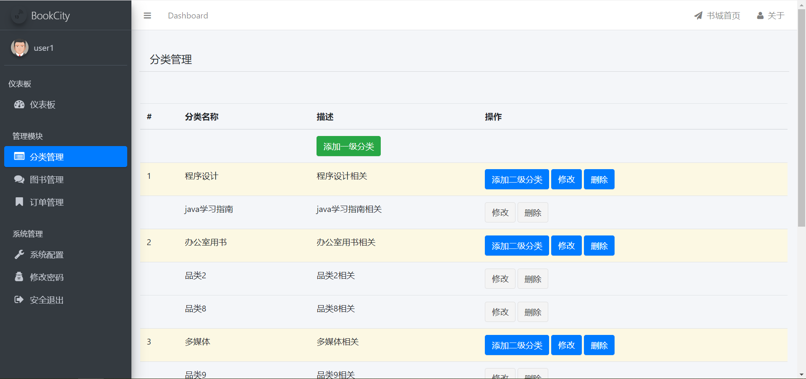
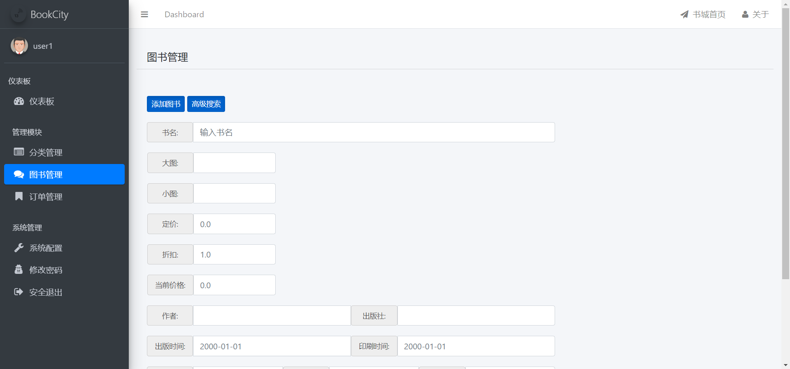
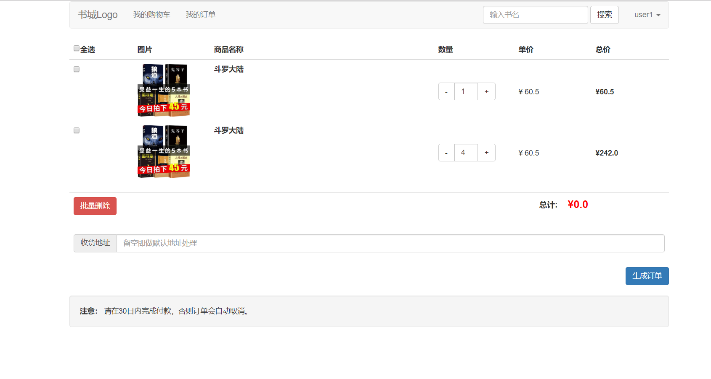
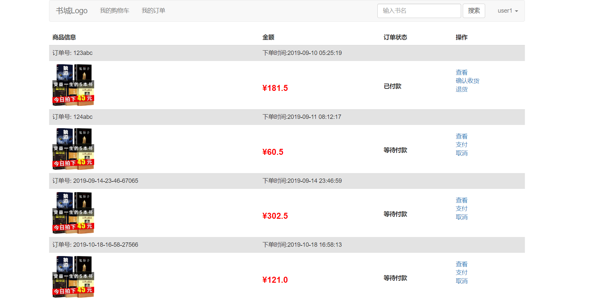
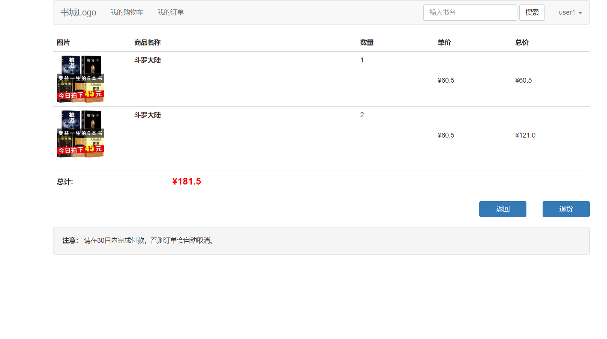

# springboot-BookCity
基于springboot的网上书城,使用了shiro权限管理框架,mybatis,themeleaf等框架.注意:由于时间问题(本人正在找实习岗),目前为半成品,前台展示基本建好,后台有待开发.

## 注意事项

- **数据库文件目录为```springbootAndBookCity/BookCity/**.sql```；**
- **还有很多不完善的地方，鄙人才疏学浅，加之近来实习找工作，望见谅；**
- **有任何问题都可以反馈给我，我会尽量完善该项目。**

## 联系作者

- 我的邮箱：1455941195@qq.com
- 状态：2020届毕业生，有任何关于java的工作可内推给我，感谢。

## 效果预览

### 后台管理页面

- 分类管理

	
  
- 图书管理

	
  
  ### 前台展示页面
  
- 首页

	
    
- 展示页1

	
    
- 展示页2

	
       
- 展示页3

	
        
  - 展示页4

	
    
## 感谢

- [ZHENFENG13](https://github.com/ZHENFENG13/My-Blog)


